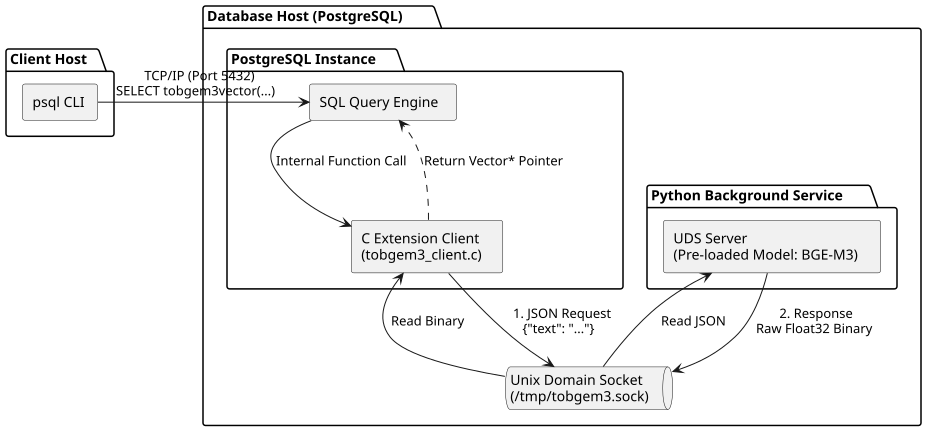

# to_bge_m3_vector
Embedding extension implemented using the BAAI/bge-m3 model for PostgreSQL

# Architecture



# Usage 
1. start bge-m3 embedding processing unix domain socket server(at server folder)
2. build and install extension (at pg_extension folder)
3. CREATE EXTENSION tobgem3_client at db instance

# Examples 
```
postgres=# select tobgem3vector('나는 너를 사랑한다.') <=> tobgem3vector('내가 너를 사랑한다.');
       ?column?
-----------------------
 0.0074454112230664116
(1개 행)

작업시간: 72.279 ms
postgres=# select tobgem3vector('나는 너를 사랑한다.') <=> tobgem3vector('나는 사과를 사랑한다.');
      ?column?
---------------------
 0.28823513104475296
(1개 행)

작업시간: 71.335 ms
```

# Caveats
* 이 코드와 예제는 학습 차원에서 100% 구글 AI 모드에서 생성된 코드임을 밝힙니다. 
* This code and its examples were generated 100% using Google AI mode for educational purposes.
